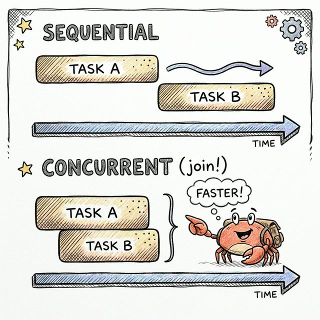

# Programación Asíncrona: Async/Await ⏳🚀

<div align="center">
  
</div>

Para entenderlo de verdad, primero tenemos que derribar un mito: **Async no es lo mismo que usar hilos (Threads)**. Aunque ambos permiten hacer "varias cosas a la vez", resuelven problemas distintos.

Vamos a desglosarlo en 3 piezas clave: **El Problema** (Hilos vs Async), **La Promesa** (Future) y **El Motor** (Tokio).

### 1. El Problema: ¿Por qué no usar simplemente Hilos? 🤔

En el capítulo de Concurrencia, creamos hilos con `thread::spawn`. Eso funciona genial si tu tarea es **CPU-Bound** (intensiva en procesador), como encriptar archivos o calcular decimales de Pi. Necesitas un núcleo de la CPU trabajando a tope.

Pero, ¿qué pasa si tu programa es un **Servidor Web**? La mayor parte del tiempo, el servidor no está calculando; está **esperando**.
*   Esperando una petición de red. 🌐
*   Esperando una consulta a la base de datos. 💾
*   Esperando leer un archivo del disco. 📂

Si creas un Hilo del Sistema Operativo (OS Thread) para cada petición que espera:
*   **Memoria:** Cada hilo consume mucha memoria (~2MB de stack por defecto). Con 10,000 conexiones, ¡la RAM explota! 💥
*   **Context Switching:** El sistema operativo gasta mucho tiempo pausando y reanudando hilos. Es burocracia cara.

#### La Solución Async (Multitarea Cooperativa)
En lugar de que el Sistema Operativo decida cuándo pausar una tarea, la tarea misma decide pausarse cuando tiene que esperar (por ejemplo, a que llegue un dato de internet).

| Enfoque | Analogía del Restaurante 🍽️ | Resultado |
| :--- | :--- | :--- |
| **Hilos** | Tienes un camarero personal asignado exclusivamente para cada mesa. Si el cliente está leyendo el menú durante 10 minutos, el camarero se queda parado mirando sin hacer nada. | **Caro e Ineficiente.** |
| **Async** | Un solo camarero súper rápido atiende 50 mesas. Toma nota, corre a la cocina, cobra a otro, y sirve a otro. Solo se detiene si hay algo que hacer realmente. | **Eficiente.** (Máximo rendimiento con mínimos recursos). |

---

### 2. ¿Qué es realmente un Future? 🔮

Aquí es donde Rust es único. En otros lenguajes (como JavaScript), una "Promesa" empieza a ejecutarse en cuanto la creas (es *Eager*).

**En Rust, un Future es Lazy. 😴**

Un `Future` no es más que una estructura de datos (una máquina de estados) que describe una operación que *eventualmente* producirá un valor. **No hace nada hasta que tú explícitamente se lo pides.**

Técnicamente, un Future es cualquier cosa que implemente este trait (simplificado):

```rust
trait Future {
    type Output;
    
    // El método 'poll' (sondear) pregunta: "¿Ya terminaste?"
    fn poll(self: Pin<&mut Self>, cx: &mut Context) -> Poll<Self::Output>;
}

enum Poll<T> {
    Ready(T), // ¡Terminé! Aquí está tu dato. ✅
```

Imagina que **Future** es como pedir una pizza 🍕:
1.  Haces el pedido (`async fn pedir_pizza()`).
2.  Te dan un ticket (el objeto `Future`).
3.  Si no le das ese ticket a alguien para que lo gestione, **la pizza nunca se empieza a cocinar.**

### 3. El Motor: Tokio 🚅

Rust, el lenguaje, sabe qué es un Future, pero **no tiene un runtime integrado** para ejecutarlos. Rust no tiene un "camarero" en la librería estándar que revise los tickets.

Aquí entra **Tokio**. Tokio es un Ejecutor (Runtime). Es el camarero hiper-eficiente.

Su trabajo es:
*   Tomar tus `Futures`.
*   Llamar a `poll()` en ellos.
*   Si un Future devuelve `Pending` (estoy esperando red), Tokio lo deja aparcado (lo duerme) y se pone a trabajar en otro Future. 💤
*   Cuando llega el dato de red, el Sistema Operativo avisa a Tokio, y Tokio vuelve a llamar a `poll()` en ese Future. 🔔

---

### Vamos al Código (La Sintaxis) 💻

Para transformar una función normal en una máquina de estados que devuelve un Future, usamos la palabra clave `async fn`.

```rust
// Esta función NO devuelve un String inmediatamente.
// Devuelve un objeto que implementa Future<Output = String>
async fn leer_base_datos() -> String {
    // Simula una espera
    "Datos del usuario".to_string()
}
```

Ahora, para saber si entendiste qué significa que un Future sea **Lazy** (Perezoso).

Mira este código dentro de un `main` normal:

```rust,edition2024
// Esta función NO devuelve un String.
// Devuelve un objeto que implementa Future<Output = String>
async fn leer_base_datos() -> String {
    // Simula una espera... ¡pero aquí no pasa nada todavía!
    println!("📖 Leyendo DB...");
    "Datos del usuario".to_string()
}

fn main() {
    let futuro = leer_base_datos();
    println!("Fin del programa");
    
    // Q: ¿Se imprimió "Leyendo DB..."?
    // A: ¡NO! Porque nadie ejecutó el futuro.
}
```

En Rust, llamar a una función `async` **no ejecuta el cuerpo de la función**. Solo construye la estructura de datos (el `Future`) y te la devuelve.

Es como si te dieran el **plano** de un edificio, pero nadie ha empezado a poner ladrillos todavía. 🏗️

Para que el código se ejecute, necesitas dos cosas:
1.  **Un Runtime (`#[tokio::main]`):** El jefe de obra. 👷‍♂️
2.  **El comando `.await`:** La orden explícita de *"construye esto ahora y avísame cuando termines"*.

### 1. Configurando Tokio (`#[tokio::main]`)
Como `main` es la función de entrada, el sistema operativo espera que sea síncrona. Para usar `async` dentro de `main`, necesitamos una macro que envuelva nuestro programa e inicie el motor de Tokio antes de ejecutar nuestro código.

### 2. La palabra mágica: `.await` ✨
Aquí es donde ocurre la magia. Cuando escribes `.await` en un Future, le estás diciendo a Rust:
> *"Pausa esta función actual, cede el control al motor de Tokio para que ejecute ese Future, y despiértame solo cuando tenga el resultado".*

Mira cómo se arregla el código:

```rust,edition2021
use tokio; 

// Esta macro transforma el main síncrono en uno asíncrono e inicia Tokio
#[tokio::main]
async fn main() {
    println!("1. Iniciando Main...");

    // 1. Aquí SOLO creamos el plan. No se ha ejecutado nada.
    let futuro = leer_base_datos(); 
    
    println!("2. El future ya está creado, pero la DB no se ha leído.");

    // 2. Aquí decimos: "Ejecútalo". 
    // El programa se "pausa" aquí (sin bloquear el hilo) hasta terminar.
    let resultado = futuro.await; 

    println!("3. Resultado final: {}", resultado);
}

async fn leer_base_datos() -> String {
    println!("   -> ¡Ahora sí me estoy ejecutando! (DB)"); // Esto sale al hacer .await
    "Datos del usuario".to_string()
}
```

## El "Yielding" (Ceder el paso) 🛑✋

Lo más importante que tenés que entender para diferenciar esto de los Hilos es lo que pasa en el `.await`.

Cuando el código llega a un `.await` que necesita esperar (por ejemplo, una respuesta de red):
*   **NO bloquea** el Hilo del Sistema Operativo. El hilo queda libre. 🔓
*   Tokio aprovecha ese mismo hilo libre para ejecutar **otra tarea distinta** que esté lista. 🔄
*   Cuando la red responde, Tokio retoma tu función justo donde la dejó. ▶️

> ♟️ **Analogía del Maestro de Ajedrez:**
> Imagina a un gran maestro jugando 50 partidas simultáneas.
> *   Hace un movimiento en la Mesa 1.
> *   Mientras su oponente piensa (espera de red), el maestro **no se queda parado esperando**.
> *   Inmediatamente se mueve a la Mesa 2 para hacer otro movimiento.
>
> **Un solo jugador (hilo), muchas partidas (tareas).**

---

### La Trampa de la Secuencialidad 🕸️

Ahora que sabemos que `.await` inicia y espera una tarea, analicemos este escenario común. Muchos creen que `async` significa automáticamente "paralelo", pero hay que tener cuidado.

Imagina que tienes dos funciones asíncronas que tardan 1 segundo cada una: `tarea_a()` y `tarea_b()`.

```rust,edition2024

use tokio::{self,time::sleep};
use std::time::Duration;

#[tokio::main]
async fn main() {
    let inicio = std::time::Instant::now();

    // Caso A: Ejecución secuencial
    let resultado_a = tarea_a().await; // Espera aquí...
    let resultado_b = tarea_b().await; // ...y luego espera acá.

    println!("Tiempo total: {:?}", inicio.elapsed());
}
/*Por el momento solo necesitamos entender que las funciones tarea_a y tarea_b tardan 1 seg cada una en ejecutarse.*/
async fn tarea_a(){
    tokio::time::sleep(Duration::from_secs(1)).await;
}
async fn tarea_b(){
    tokio::time::sleep(Duration::from_secs(1)).await;
}
```

<div class="quiz-container">
  <p class="quiz-question"><strong>Pregunta:</strong> Sabiendo que <code>.await</code> pausa la función actual hasta que el future termina... ¿Cuánto tiempo crees que tardará en ejecutarse este bloque de código?</p>
  
  <details class="quiz-option">
    <summary>⏱️ Opción A: Aproximadamente 1 segundo (se ejecutan a la vez).</summary>
    <div class="quiz-answer incorrect">
      ❌ <strong>Incorrecto.</strong> El <code>.await</code> detiene la ejecución en la línea 6 hasta que <code>tarea_a</code> termina por completo. Recién ahí empieza <code>tarea_b</code>.
    </div>
  </details>

  <details class="quiz-option">
    <summary>🐢 Opción B: Aproximadamente 2 segundos (uno después del otro).</summary>
    <div class="quiz-answer correct">
      ✅ <strong>¡Correcto!</strong> Aunque las funciones son asíncronas, al hacer <code>await</code> inmediatamente, estás forzando un orden secuencial. ¡No has ganado concurrencia todavía!
    </div>
  </details>
</div>


### ¿Cómo logramos que tarden 1 segundo? (`join!`) ⚡

Para que `tarea_a` y `tarea_b` avancen a la vez (**concurrencia**), tenemos que iniciar sus Futures al mismo tiempo y esperar a ambos juntos.

Para esto, Tokio nos ofrece la macro **`tokio::join!`**.

```rust,edition2021
use tokio::time::{sleep, Duration};

#[tokio::main]
async fn main() {
    let inicio = std::time::Instant::now();

    println!("Inicio...");

    // 1. Creamos los futures pero NO les ponemos .await todavía
    // Recuerda: son "perezosos", aquí aún no han arrancado realmente.
    let futuro_a = tarea_a();
    let futuro_b = tarea_b();

    // 2. El join! sondea (poll) ambos futures a la vez en el mismo hilo.
    // Avanza un poquito en A, luego en B, luego en A...
    let (res_a, res_b) = tokio::join!(futuro_a, futuro_b);

    println!("Tiempo total: {:?}", inicio.elapsed()); // ~1.00s segundos
}

async fn tarea_a() {
    sleep(Duration::from_secs(1)).await;
}

async fn tarea_b() {
    sleep(Duration::from_secs(1)).await;
}
```

### Entendiendo la Magia línea por línea 🔍

1.  **Creación Perezosa:**
    ```rust
    let futuro_a = tarea_a(); // Se crea la estructura FutureA. NO se ejecuta.
    let futuro_b = tarea_b(); // Se crea la estructura FutureB. NO se ejecuta.
    ```
    Aquí solo hemos preparado los "tickets". Nadie ha ido a la cocina todavía.

2.  **Ejecución Concurrente:**
    ```rust
    let (res_a, res_b) = tokio::join!(futuro_a, futuro_b); 
    ```
    Básicamente, `join!` le dice al Runtime: *"Ejecuta los dos (`futuro_a` y `futuro_b`) avanzando lo que puedas en cada uno hasta que ambos terminen"*.

---

### 🚨 Importante: Paralelismo vs Concurrencia

Hay algo fundamental que debes entender sobre `tokio::join!`:
> La ejecución **NO es paralela** (en hilos separados), sino **concurrente** (en el mismo hilo/tarea, turnándose muy rápido).

**Las Reglas del `join!`:**

1.  **Orden de Polling (Sondeo):** `join!` intenta avanzar sus futuros uno por uno. El orden exacto no está garantizado, pero conceptualmente es un "toma y daca":
    *   Intenta avanzar `futuro_a`.
    *   Si `a` se pausa (encuentra un `.await`), pasa a `futuro_b`.
    *   Si `b` se pausa, vuelve a `a`... y así sucesivamente.
    
    > `futuro_a` ➡️ `futuro_b` ➡️ `futuro_a` ➡️ ...

### Visualizando el Flujo del Tiempo ⏳

Para que quede claro, comparemos lo que realmente pasa en el procesador:

#### 1. Caso Secuencial vs Concurrente (join!)

En la parte superior (**Secuencial**), vemos cómo las tareas se ejecutan una después de la otra, tomando 2 segundos en total.
En la parte inferior (**Concurrente**), con `join!`, ambas avanzan juntas aprovechando las esperas, reduciendo el tiempo total a la mitad (1 segundo).

<div align="center">
  
</div>

Para los más técnicos, así se ve el flujo detallado en el procesador:

#### 1. Caso Secuencial (2 Segundos)
Aquí la Tarea B tiene que esperar aburrida a que la Tarea A termine por completo.

```text
Tiempo | Tarea A       | Tarea B
-------|---------------|---------------
0.0s   | INICIO        | (Esperando...)
       | .             | .
       | Trabajando... | .
       | .             | .
1.0s   | FIN           | (Esperando...)
       |               | INICIO
       |               | .
       |               | Trabajando...
       |               | .
2.0s   |               | FIN
```

#### 2. Caso Concurrente con `join!` (1 Segundo)
Aquí ambas tareas arrancan. Cuando A se bloquea (ej. esperando timer), el runtime cambia a B inmediatamente.

```text
Tiempo | Tarea A       | Tarea B
-------|---------------|---------------
0.0s   | INICIO        | INICIO
       | (await 1s) 🛑 | .
       | .             | (await 1s) 🛑
       | .             | .
       | (Dormida)     | (Dormida)
       | .             | .
       | .             | .
1.0s   | DESPIERTA 🔔  | DESPIERTA 🔔
       | FIN           | FIN
```
*(Nota cómo ambas están "esperando" solapadamente en el tiempo).*

---

### Paralelismo Real y Tareas Bloqueantes 🧵

Hasta ahora hemos visto **Concurrencia** (un chef haciendo muchas cosas en una sola cocina).
Pero, ¿qué pasa si tenemos una tarea "pesada" o "bloqueante"? (Ej. encriptar una contraseña, comprimir un archivo zip, o usar una función que duerme el hilo).

Si metemos esa tarea pesada en nuestro loop asíncrono normal, **bloquearemos a todo el mundo**.

Veamos este ejemplo:
Supongamos que tenemos las funciones `tarea_a`, `tarea_b` (rápidas) y `tarea_pesada` (lenta y bloqueante).

```rust,edition2021
use std::thread;
use std::time::Duration;
use tokio::time::sleep; // Usamos el sleep asíncrono para las tareas buenas

#[tokio::main]
async fn main() {
    let inicio = std::time::Instant::now();
    println!("🚀 Inicio...");
    
    // Al usar join!, estamos poniendo a todos en el MISMO hilo.
    let future_a = tarea_a();
    let future_pesado = tarea_pesada(); // ⚠️ Esta bloqueará el hilo
    let future_b = tarea_b();
    
    // Intentamos correr todo junto...
    let (_, _, _) = tokio::join!(future_a, future_b, future_pesado);
    
    println!("🏁 Tiempo total: {:?}", inicio.elapsed());
}

async fn tarea_a() {
    println!("   🟢 Tarea A: INICIO");
    for i in 1..=2 {
        sleep(Duration::from_millis(500)).await; 
        println!("   🟢 Tarea A: avance {}", i);
    }
    println!("   🟢 Tarea A: FIN");
}

async fn tarea_b() {
    println!("   🔵 Tarea B: INICIO");
    for i in 1..=2 {
        sleep(Duration::from_millis(500)).await;
        println!("   🔵 Tarea B: avance {}", i);
    }
    println!("   🔵 Tarea B: FIN");
}

// ⚠️ ESTA FUNCIÓN ESTÁ MAL IMPLEMENTADA A PROPÓSITO
async fn tarea_pesada() {
    println!("   🔴 Tarea PESADA: INICIO (Bloqueando hilo...)");
    //Usar thread::sleep bloquea todo el runtime de Tokio
    thread::sleep(Duration::from_secs(2)); 
    println!("   🔴 Tarea PESADA: FIN");
}
```

### Análisis del Desastre 💥

Si ejecutas este código, verás algo parecido a esto:

```text
🚀 Inicio...
   🟢 Tarea A: INICIO
   🔵 Tarea B: INICIO
   🔴 Tarea PESADA: INICIO (Bloqueando hilo...)
   🔴 Tarea PESADA: FIN    <-- ¡Pasaron 2 segundos y nadie más se movió!
   🔵 Tarea B: avance 1
   🟢 Tarea A: avance 1
   ...
```

**¿Qué pasó aquí?**
1.  `Tarea Pesada` secuestró el hilo con `thread::sleep`.
2.  Aunque `Tarea A` y `B` solo querían dormir 500ms, tuvieron que esperar los 2 segundos completos porque el "camarero" (el hilo) estaba paralizado.
3.  Una vez que el hilo se liberó, Tokio retomó las tareas pendientes.
    *   *Nota:* El orden exacto en que se retoman (si A o B van primero) depende del planificador de Tokio, pero el daño ya está hecho: **La concurrencia murió durante 2 segundos.**

### La Solución: `tokio::spawn` �

La forma más común de lograr paralelismo/concurrencia real en Tokio es usando **`tokio::spawn`**.

Piensa en `spawn` como `thread::spawn`, pero para tareas asíncronas. Lanza la tarea al fondo (background) y te devuelve un "manejador" (`JoinHandle`) inmediatamente, sin esperar a que termine.

**Diferencia Clave con `join!`:**
*   `join!(a, b)`: Espera a A y B *aquí y ahora*.
*   `spawn(a)`: Lanza A "al aire" para que corra por su cuenta y el código sigue ejecutándose.

### Prueba Final: Usando `spawn` ✅

Si envolvemos nuestra tarea pesada en un `tokio::spawn`, la "desacoplamos" del flujo principal `main`.

> *Nota: En un entorno real, para tareas que bloquean threads (CPU heavy o sleep), lo ideal es `spawn_blocking`, pero `spawn` sirve aquí para ilustrar cómo lanzar tareas independientes.*

```rust,edition2021
use std::thread;
use std::time::Duration;
use tokio::time::sleep;

#[tokio::main]
async fn main() {
    let inicio = std::time::Instant::now();
    println!("🚀 Inicio...");
    
    let future_a = tarea_a();
    let future_b = tarea_b();
    
    // 🔥 AQUÍ ESTÁ LA MAGIA:
    // Lanzamos la tarea pesada al "fondo". 
    // spawn devuelve un JoinHandle que es un Future en sí mismo.
    let handle_pesado = tokio::spawn(tarea_pesada()); 
    
    // Ahora 'handle_pesado' es una promesa de que esa tarea terminará en algún momento.
    // Mientras tanto, join! se encarga de A y B concurrentemente.
    let (_, _, _) = tokio::join!(future_a, future_b, handle_pesado);
    
    println!("🏁 Tiempo total: {:?}", inicio.elapsed());
}

async fn tarea_pesada() {
    println!("   🔴 Tarea PESADA: INICIO");
    // Aunque esto bloquea, al estar en otro spawn (y si hay workers libres),
    // el main puede seguir.
    thread::sleep(Duration::from_secs(2)); 
    println!("   🔴 Tarea PESADA: FIN");
}

/*
   ─────────────────────────────────────────────────────────────────
   🤔 ¿Para qué sirve `tokio::spawn` realmente?
   ─────────────────────────────────────────────────────────────────

   Quizás te preguntes: "¿Por qué no usar simplemente join! sin spawn?"

   1. La Tarea Nueva (Task): 
      Un Future normal es pasivo. `spawn` lo convierte en una Tarea Activa gestionada por Tokio.
   
   2. Paralelismo Real (Multi-Hilo): 
      Si tu PC tiene 8 núcleos, Tokio puede tomar esa tarea "spawned" y moverla
      físicamente a otro hilo/núcleo. Con `join!` simple, a veces todo se queda
      en el mismo hilo compitiendo por tiempo.

   3. "Lanzar y Olvidar" (Fire & Forget):
      Podrías lanzar `tokio::spawn(tarea())` y NO hacerle `.await`.
      La tarea seguiría corriendo en segundo plano mientras tú haces otras cosas.
*/


async fn tarea_a() {
    println!("   🟢 Tarea A: INICIO");
    for i in 1..=2 {
        sleep(Duration::from_millis(500)).await; 
        println!("   🟢 Tarea A: avance {}", i);
    }
    println!("   🟢 Tarea A: FIN");
}

async fn tarea_b() {
    println!("   🔵 Tarea B: INICIO");
    for i in 1..=2 {
        sleep(Duration::from_millis(500)).await;
        println!("   🔵 Tarea B: avance {}", i);
    }
    println!("   🔵 Tarea B: FIN");
}
```

**Resultado Esperado:**
Verás que `Tarea A` y `Tarea B` imprimen sus avances **mientras** la `Tarea PESADA` todavía se está ejecutando en segundo plano. ¡Ya no hay bloqueos! 🎉