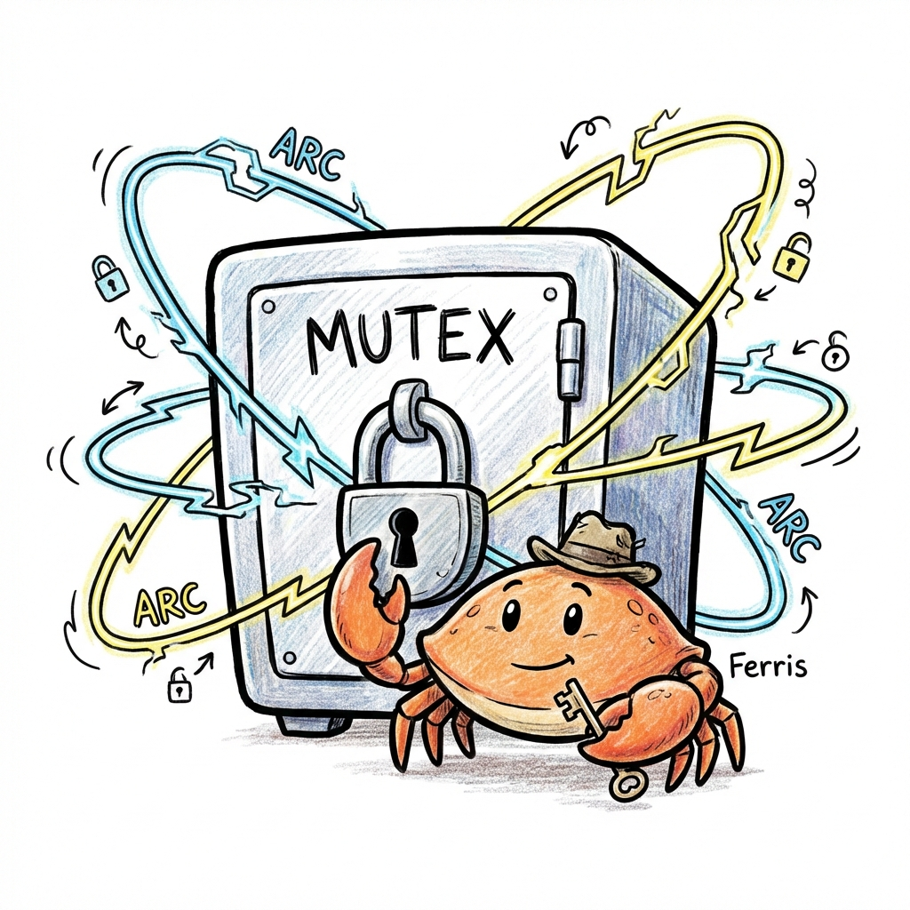
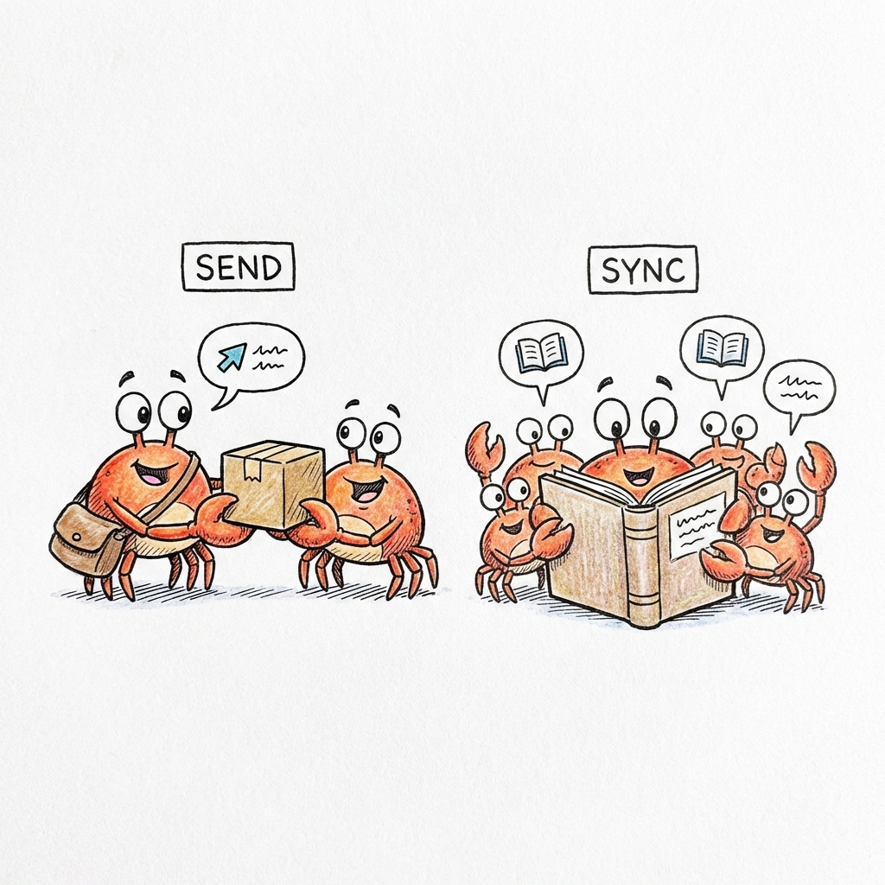

# Concurrencia sin miedo 🦀🚀

La concurrencia es un tema que siempre da mucho para hablar. Aprender a usarla parece fácil al principio y no tiene una carga teórica tan pesada, pero a medida que los programas escalan, es muy probable que aparezcan errores de esos que en algunos casos son pavadas, pero en otros nos dan una frustración que no vamos a olvidar nunca.

En otros lenguajes (como C, C++ o Java) te dan herramientas muy potentes pero te dejan solo en el medio del baile para que te las arregles. Si no sos un experto, es muy fácil equivocarte; el programa te va a compilar igual, pero cuando lo vayas a ejecutar empieza el verdadero miedo y te vas a preguntar por qué no te dedicaste a la abogacía. Incluso para los más experimentados, este tema suele ser un dolor de cabeza constante.

Pero Rust no te deja tirado. El mismo sistema de *ownership* y tipos que nos protege de errores de memoria en un solo hilo, nos cuida las espaldas cuando trabajamos con múltiples hilos al mismo tiempo, casi sin sacrificar rendimiento. Lo hace avisándote de los errores en la etapa de compilación y no cuando el programa ya está corriendo y es tarde para lamentarse.


<div align="center">
  
</div>

Para dominar la concurrencia en Rust, vamos a dividirla en cuatro pilares:

1.  **Hilos (Threads) y move closures:** La base de la ejecución paralela.
2.  **Paso de Mensajes (Channels):** Comunicación segura entre hilos (estilo Go).
3.  **Estado Compartido (Mutex y Arc):** Bloqueos y referencias atómicas (la evolución de `RefCell` y `Rc`).
4.  **Los Traits Send y Sync:** La magia del sistema de tipos que permite (o prohíbe) la concurrencia.

---

## Pilar 1: Hilos y el movimiento de datos (`move`)

Comencemos con lo básico: `std::thread`. Al igual que en otros lenguajes, Rust permite crear un hilo para ejecutar código en paralelo. Para ello, utilizamos la función `thread::spawn` y le pasamos un **closure** (una función anónima) que contiene las instrucciones que el hilo ejecutará.

### ¿Qué pasa con los hilos y el hilo principal?

Cuando se lanza un hilo en Rust, este comienza su ejecución de forma independiente. Sin embargo, hay un detalle fundamental a tener en cuenta: **si la función `main` termina, el programa entero se cierra**, sin importar si los hilos secundarios finalizaron su tarea o no. Es como si el jefe apagara la luz de la oficina y cerrara con llave mientras todavía estás intentando corregir errores.

Mira este ejemplo en acción:

```rust
use std::thread;
use std::time::Duration;

fn main() {
    thread::spawn(|| {
        for i in 1..10 {
            println!("Hola número {} desde el hilo generado!", i);
            thread::sleep(Duration::from_millis(1));
        }
    });

    for i in 1..5 {
        println!("Hola número {} desde el hilo principal!", i);
        thread::sleep(Duration::from_millis(1));
    }
}
```

Si ejecutas este código, notarás que el programa termina en cuanto el hilo principal completa sus mensajes, dejando al hilo generado incompleto.

> **¿Para qué sirve el `thread::sleep`?**
> En este ejemplo, usamos `thread::sleep` para obligar al hilo a detenerse por un milisegundo. Esto fuerza al planificador del sistema operativo a alternar entre los hilos, permitiéndonos ver cómo se intercalan los mensajes en la consola. Sin estas pausas, es muy probable que uno de los hilos termine todo su trabajo antes de que el otro siquiera comience, dificultando la observación del comportamiento paralelo.


Para evitar este cierre repentino, utilizamos el método `.join()`. La función `thread::spawn` devuelve un valor llamado **JoinHandle**. Al llamar a `.join()` sobre este handle, obligamos al hilo principal a esperar hasta que el hilo secundario termine su ejecución.

> **Nota técnica: ¿Existe el "detach" en Rust?**
> A diferencia de lenguajes como C++, en Rust no hay un método específico para "desacoplar" un hilo. En Rust, un hilo se considera desacoplado automáticamente si no guardas el `JoinHandle` (el resultado de `spawn`) en una variable o si dicha variable sale de su ámbito. Esto permite que el hilo corra de forma independiente, pero no te olvides que aunque esté desacoplado, morirá instantáneamente si el hilo principal termina.

Intentemos crear uno y veamos qué sucede:

```rust
use std::thread;

fn main() {
    let v = vec![1, 2, 3];

    let handle = thread::spawn(|| {
        println!("Aquí está el vector: {:?}", v);
    });

    handle.join().unwrap(); // Esperamos a que termine el hilo
}
```

Si intentas compilar esto, Rust mostrará un error relacionado con los *lifetimes*, indicando que el closure podría vivir más tiempo que la función actual.

Para entender por qué Rust prohíbe esto, analicemos la siguiente situación:

> **Pregunta:** Imagina que `thread::spawn` no nos obligara a esperar con `join()`. Si el hilo principal (`main`) termina su ejecución mientras el hilo secundario aún está procesando, ¿qué pasaría físicamente con la memoria del vector `v` y con el hilo secundario?
>
> **Respuesta:** Aquí ocurren dos cosas importantes:
>
> 1.  **A nivel de Memoria (Sistema Operativo):** Cuando el proceso termina porque `main` cerró, el sistema operativo reclama **toda** la memoria asociada. Físicamente, la memoria de `v` se libera y vuelve a estar disponible para el sistema.
> 2.  **A nivel de Lógica (Rust):** El hilo secundario se detiene abruptamente. Rust no llega a ejecutar los destructores (**trait `Drop`**) de las variables en ese hilo. Si tenías un objeto que debía guardar datos en un archivo o cerrar una conexión antes de finalizar, esa limpieza **no ocurrirá**. 
>
> Por lo tanto, el hilo secundario intentaría leer una memoria que el sistema operativo ya ha reclamado, provocando un error crítico de **Use-After-Free**. Rust evita esto impidiendo la compilación.

Como Rust no puede determinar en tiempo de compilación cuánto tardará un hilo en ejecutarse, asume el peor de los casos. Por ello, no permite que el hilo tome una referencia "prestada" (`&v`) de `main`.

### La Solución: `move`

Para solucionar esto, debemos indicar a Rust que el hilo no debe tomar prestada la variable `v`, sino **tomar su propiedad (ownership)**. De esta forma, el hilo se convierte en el dueño de esa memoria y será responsable de liberarla al terminar, independientemente de lo que haga `main`.

Esto se logra utilizando la palabra clave `move` antes del closure:

```rust
use std::thread;

fn main() {
    let v = vec![1, 2, 3];

    // La palabra clave 'move' obliga al closure a tomar posesión de 'v'
    let handle = thread::spawn(move || {
        println!("Aquí está el vector dentro del hilo: {:?}", v);
    });

    handle.join().unwrap();
}
```

Para verificar si el concepto de *Ownership* ha quedado claro:

<div class="quiz-container">
  <p class="quiz-question"><strong>Pregunta:</strong> Si intentaras agregar la línea <code>println!("{:?}", v);</code> en la función <code>main</code> después del <code>thread::spawn</code>, ¿qué sucedería?</p>
  
  <details class="quiz-option">
    <summary>1️⃣ Opción 1: Funcionaría correctamente porque <code>v</code> sigue existiendo.</summary>
    <div class="quiz-answer incorrect">
      ❌ <strong>Incorrecto.</strong> Aunque el vector siga en el heap, para Rust ese espacio ya no le pertenece al <code>main</code>. Si lo dejara usar, estaríamos rompiendo la regla de oro del Ownership.
    </div>
  </details>

  <details class="quiz-option">
    <summary>2️⃣ Opción 2: Error de compilación: <code>v</code> ya no es válido en porque su propiedad se movió.</summary>
    <div class="quiz-answer correct">
      ✅ <strong>¡Exacto!</strong> Al usar la palabra clave <code>move</code>, transferiste la propiedad al hilo. Por eso el compilador te frena si intentas tocar <code>v</code> en <code>main</code> después del spawn. Esto evita las carreras de datos por diseño.
    </div>
  </details>

  <details class="quiz-option">
    <summary>3️⃣ Opción 3: Error de compilación: <code>v</code> es inmutable y no se puede leer dos veces.</summary>
    <div class="quiz-answer incorrect">
      ❌ <strong>Incorrecto.</strong> En Rust puedes tener múltiples lecturas inmutables. El error aquí no es la cantidad de lecturas, sino que el <code>main</code> ya no es el dueño del dato.
    </div>
  </details>
  <p class="no-print" style="font-size: 0.85em; opacity: 0.7; margin-top: 10px; text-align: right;"><i>Haz clic en cada opción para ver la respuesta.</i></p>
</div>

---

## Pilar 2: Paso de Mensajes (Channels) 📨

Ahora, ¿qué pasa si los hilos necesitan hablar entre sí?

Rust abraza una filosofía popularizada por el lenguaje Go: **"No te comuniques compartiendo memoria; comparte memoria comunicándote"**.

Para esto usamos **Canales (Channels)**. La librería estándar ofrece `mpsc`, que significa *Multiple Producer, Single Consumer* (Múltiples Productores, Un Solo Consumidor).

Imagina un río:
*   Puedes tener muchos arroyos (**transmisores `tx`**) tirando barquitos de papel al río.
*   Pero al final del río, solo hay una red (**receptor `rx`**) atrapándolos.

<div align="center">
  
</div>

Mira este ejemplo donde un hilo manda un mensaje al principal:

```rust
use std::sync::mpsc;
use std::thread;

fn main() {
    // Creamos el canal. Nos devuelve una tupla (transmisor, receptor)
    let (tx, rx) = mpsc::channel();

    thread::spawn(move || {
        let mensaje = String::from("¡Hola desde el hilo!");
        
        // Enviamos el mensaje por el tubo
        tx.send(mensaje).unwrap();
        
        // ¿Podríamos usar 'mensaje' aquí abajo?
    });

    // El hilo principal espera recibir algo (se bloquea hasta que llegue)
    let recibido = rx.recv().unwrap();
    println!("Recibido: {}", recibido);
}
```

Aquí viene la pregunta para conectar esto con el Ownership:

<div class="quiz-container">
  <p class="quiz-question"><strong>Pregunta:</strong> La función <code>send()</code> toma el valor que le pasas (en este caso, la variable <code>mensaje</code>). Si intentáramos escribir <code>println!("{}", mensaje);</code> justo después de la línea <code>tx.send(mensaje).unwrap();</code>, ¿qué crees que sucedería?</p>
  
  <details class="quiz-option">
    <summary>1️⃣ Opción 1: Imprimiría "¡Hola desde el hilo!" sin problemas, ya que enviamos una copia.</summary>
    <div class="quiz-answer incorrect">
      ❌ <strong>Incorrecto.</strong> <code>String</code> no implementa el trait <code>Copy</code>. Al enviarlo por el canal, estamos transfiriendo la propiedad real del dato.
    </div>
  </details>

  <details class="quiz-option">
    <summary>2️⃣ Opción 2: Error de compilación: <code>mensaje</code> se movió dentro del canal y ya no pertenece a este hilo.</summary>
    <div class="quiz-answer correct">
      ✅ <strong>¡Exacto!</strong> Esto es brillante porque elimina toda una categoría de errores: si has enviado el dato a otro hilo, el compilador te impide modificarlo accidentalmente en el hilo original. ¡Adiós a las condiciones de carrera por diseño!
    </div>
  </details>

  <details class="quiz-option">
    <summary>3️⃣ Opción 3: Error en tiempo de ejecución (panic) porque el hilo principal ya lo leyó.</summary>
    <div class="quiz-answer incorrect">
      ❌ <strong>Incorrecto.</strong> Rust prefiere avisarte antes. El <i>Borrow Checker</i> detecta que intentas usar una variable que ya no posees y te frena en tiempo de compilación.
    </div>
  </details>
  <p class="no-print" style="font-size: 0.85em; opacity: 0.7; margin-top: 10px; text-align: right;"><i>Haz clic en cada opción para ver la respuesta.</i></p>
</div>

### Múltiples Productores y el Receptor como Iterador

Una de las potencias de `mpsc` es que podemos clonar el transmisor para que varios hilos envíen mensajes a la misma red. Además, el receptor `rx` puede ser tratado como un iterador, lo que hace el código mucho más limpio:

```rust
use std::sync::mpsc;
use std::thread;
use std::time::Duration;

fn main() {
    let (tx, rx) = mpsc::channel();

    // Clonamos el transmisor para el hilo 1
    let tx1 = tx.clone();
    thread::spawn(move || {
        let vals = vec!["hola", "desde", "hilo", "uno"];
        for val in vals {
            tx1.send(String::from(val)).unwrap();
            thread::sleep(Duration::from_millis(200));
        }
    });

    // Usamos el transmisor original para el hilo 2
    thread::spawn(move || {
        let vals = vec!["más", "mensajes", "para", "vOS"];
        for val in vals {
            tx.send(String::from(val)).unwrap();
            thread::sleep(Duration::from_millis(200));
        }
    });

    // Tratamos a rx como un iterador. 
    // El bucle termina automáticamente cuando todos los transmisores se cierran.
    for recibido in rx {
        println!("Recibido: {}", recibido);
    }
}
```

---

## Pilar 3: Estado Compartido (Mutex y Arc) 🔐

A veces, los canales no son suficientes. Imagina que tienes una base de datos en memoria o un contador global que 10 hilos necesitan leer y actualizar a la vez. No puedes estar "enviando" la base de datos de un lado a otro constantemente; lo que necesitas es un **acceso compartido**.

<div align="center">
  
</div>

Aquí es donde Rust nos obliga a ser explícitos usando dos herramientas que trabajan en equipo, muy similares a las que vimos en el [capítulo de Smart Pointers](./smart_pointer.md) (`Rc` y `RefCell`), pero en su versión "Thread-Safe" (seguras para hilos).

### 1. `Mutex<T>` (Mutual Exclusion)
Es el "primo hermano" de [`RefCell`](./smart_pointer.md#3-mutabilidad-interior-refcellt).
*   **`RefCell`**: Te permite mutar el interior. Si rompes las reglas de préstamo en tiempo de ejecución → **Panic** 💥.
*   **`Mutex`**: Te permite mutar el interior. Si alguien más lo está usando en ese momento → **Bloquea** al hilo actual y lo pone en espera 🛑.

Para acceder al dato dentro de un `Mutex`, debes pedir el candado llamando al método `.lock()`.

### 2. `Arc<T>` (Atomic Reference Counting)
Es el "hermano gemelo" de [`Rc`](./smart_pointer.md#2-propiedad-compartida-rct-y-weakt).
*   **`Rc`**: Cuenta referencias usando matemáticas normales. Es rápido, pero peligroso en hilos porque dos hilos podrían intentar actualizar el contador al mismo tiempo y corromperlo.
*   **`Arc`**: Cuenta referencias usando **operaciones atómicas** del procesador. Es un poco más costoso en rendimiento, pero garantiza seguridad total entre hilos.

> **⚠️ Nota de Seguridad:** 
> ¿Por qué no usamos simplemente `Rc` o `RefCell` con hilos? Porque no implementan el trait `Sync`. Rust detecta esto y **se niega a compilar** si intentas enviarlos a otro hilo, evitando así que tu programa explote por una corrupción de memoria silenciosa.

### El Patrón de Oro: `Arc<Mutex<T>>`
Casi siempre verás estos dos juntos. El `Arc` nos permite tener múltiples dueños del candado, y el `Mutex` protege al dato que vive dentro.

Mira este ejemplo de un contador compartido:

```rust
use std::sync::{Arc, Mutex};
use std::thread;

fn main() {
    // 1. Creamos el contador protegido (Mutex) y compartido (Arc)
    let contador = Arc::new(Mutex::new(0));
    let mut handles = vec![];

    for _ in 0..10 {
        // 2. Clonamos el Arc para este hilo (incrementa el contador atómico)
        let contador_clon = Arc::clone(&contador);

        let handle = thread::spawn(move || {
            // 3. Bloqueamos el Mutex para obtener acceso exclusivo
            let mut num = contador_clon.lock().unwrap();

            // 4. Modificamos el dato
            *num += 1;
            
            // ¿Y aquí? ¿Cómo soltamos el candado? 🤔
        });
        handles.push(handle);
    }

    for handle in handles {
        handle.join().unwrap();
    }

    println!("Resultado final: {}", *contador.lock().unwrap());
}
```

Aquí está la pregunta crítica para entender la elegancia de Rust:

En otros lenguajes (como C, C++ o Java), sueles tener un método `lock()` y obligatoriamente un método `unlock()`. Si el programador olvida el `unlock`, el programa se bloquea para siempre (**Deadlock**).

<div class="quiz-container">
  <p class="quiz-question"><strong>Pregunta:</strong> En el código de arriba, no escribimos ninguna línea para desbloquear (<code>unlock</code>) el Mutex. Basándonos en lo que aprendiste sobre <code>Box</code> y el trait <code>Drop</code>, ¿en qué momento se libera el candado?</p>
  
  <details class="quiz-option">
    <summary>1️⃣ Opción 1: Rust lo libera en cuanto terminamos de escribir la línea <code>*num += 1;</code>.</summary>
    <div class="quiz-answer incorrect">
      ❌ <strong>Incorrecto.</strong> El compilador no puede saber mágicamente cuándo terminaste de usar la variable. Necesitás un mecanismo más robusto.
    </div>
  </details>

  <details class="quiz-option">
    <summary>2️⃣ Opción 2: Al momento de salir del ámbito (scope), el "guardián" del Mutex se destruye y libera el acceso.</summary>
    <div class="quiz-answer correct">
      ✅ <strong>¡Correcto!</strong> Técnicamente, <code>lock()</code> devuelve un Smart Pointer llamado <code>MutexGuard</code>. Este objeto implementa <code>Deref</code> para que accedas al dato, y lo más importante, implementa <code>Drop</code> para liberar el candado automáticamente cuando el <code>MutexGuard</code> sale de su ámbito.
    </div>
  </details>

  <details class="quiz-option">
    <summary>3️⃣ Opción 3: No se libera nunca, el sistema operativo lo hace por nosotros al final del programa.</summary>
    <div class="quiz-answer incorrect">
      ❌ <strong>Incorrecto.</strong> Si fuera así, el segundo hilo se quedaría esperando eternamente al primero. El candado se libera mucho antes de que termine el programa.
    </div>
  </details>
  <p class="no-print" style="font-size: 0.85em; opacity: 0.7; margin-top: 10px; text-align: right;"><i>Haz clic en cada opción para ver la respuesta.</i></p>
</div>

Esto evita el error humano de "olvidé desbloquear" que ha causado miles de errores históricos en la programación.

---

## Pilar 4: Los Traits Send y Sync 🧬

Llegamos a la "magia" final. ¿Cómo sabe Rust que `Arc` se puede usar en hilos pero `Rc` no? ¿O que `Mutex` es seguro y `RefCell` no?

No es magia negra, es el sistema de tipos. Existen dos **Marker Traits** (traits sin métodos que sirven como etiquetas) que el compilador verifica automáticamente para garantizar la seguridad:

<div align="center">
  
</div>

### 1. `Send` 🚚 (Transferible)
Un tipo es `Send` si es seguro enviar su propiedad (*Ownership*) de un hilo a otro.
*   **Casi todo en Rust es `Send`**: `i32`, `String`, `Box`, `Vec`, etc.
*   **Excepción notable**: Los punteros crudos (*raw pointers*) y tipos que los usan de forma no segura para hilos, como **`Rc<T>`**. Si `Rc` fuera `Send`, dos hilos podrían clonarlo a la vez y corromper el contador.

### 2. `Sync` 🔄 (Compartible)
Un tipo `T` es `Sync` si es seguro que múltiples hilos accedan a él a través de referencias compartidas (`&T`) al mismo tiempo.
*   **En términos lógicos**: `T` es `Sync` si y solo si `&T` es `Send`.
*   **Ejemplo**: `Mutex<T>` es `Sync` (puedes pasarlo por referencia entre hilos porque él se encarga de bloquear el acceso), pero **`RefCell<T>`** no lo es.

### ¿Por qué esto es importante?
Porque estos traits son **automáticos**. Rust analiza tus estructuras: si todos los campos de tu `struct` son `Send`, entonces tu `struct` es automáticamente `Send`. No tienes que implementar nada manualmente a menos que estés haciendo cosas muy avanzadas con código `unsafe`.

Para verificar si el concepto de *Ownership* ha quedado claro:

<div class="quiz-container">
<p class="quiz-question"><strong>Pregunta Final:</strong> Si intentas enviar un <code>Rc&lt;String&gt;</code> a otro hilo usando <code>thread::spawn</code>, ¿qué sucede?</p>

<details class="quiz-option">
<summary>1️⃣ Opción 1: El programa compila pero explota (panic) al intentar clonar el Rc en el segundo hilo.</summary>
<div class="quiz-answer incorrect">
❌ <strong>Incorrecto.</strong> Rust no te deja llegar tan lejos. El sistema de hilos requiere que los datos sean <code>Send</code>, y <code>Rc</code> no lo es.
</div>
</details>

<details class="quiz-option">
<summary>2️⃣ Opción 2: Error de compilación: El compilador detecta que 'Rc' no implementa 'Send' y te impide ejecutar el código.</summary>
<div class="quiz-answer correct">
✅ <strong>¡Correcto!</strong> Esta es la esencia de la "Concurrencia sin Miedo". El compilador usa estos traits como una lista de verificación de seguridad. Si intentas algo peligroso, el compilador te frena antes de que puedas cometer el error.
</div>
</details>

<details class="quiz-option">
<summary>3️⃣ Opción 3: Funciona bien siempre y cuando no intentes modificar el String.</summary>
<div class="quiz-answer incorrect">
❌ <strong>Incorrecto.</strong> El problema no es el <code>String</code>, sino el contador interno del <code>Rc</code>, que no es atómico y podría corromperse incluso solo clonando la referencia.
</div>
</details>

<p class="no-print" style="font-size: 0.85em; opacity: 0.7; margin-top: 10px; text-align: right;"><i>Haz clic en cada opción para ver la respuesta.</i></p>
</div>

---

## Resumen Final: Tu Caja de Herramientas 🧰

| Herramienta | Propósito Principal |
| :--- | :--- |
| **`thread::spawn`** | Crear un nuevo hilo de ejecución. |
| **`move` closures** | Mover la propiedad de los datos al hilo secundario. |
| **`mpsc::channel`** | Comunicación mediante el paso de mensajes (**Arroyos y Red**). |
| **`Arc<T>`** | Puntero inteligente para múltiples dueños en hilos (**Contador Atómico**). |
| **`Mutex<T>`** | Acceso exclusivo a un dato mediante bloqueos (**La Caja Fuerte**). |
| **`Send / Sync`** | Las etiquetas mágicas que garantizan que todo lo anterior sea seguro. |

> **🚀 Conclusión:** La concurrencia en Rust no es algo que debas evitar, sino algo que debes abrazar. Con el sistema de Ownership y estos cuatro pilares, puedes construir programas multihilo masivos con la confianza de que no habrá errores ocultos de memoria.
