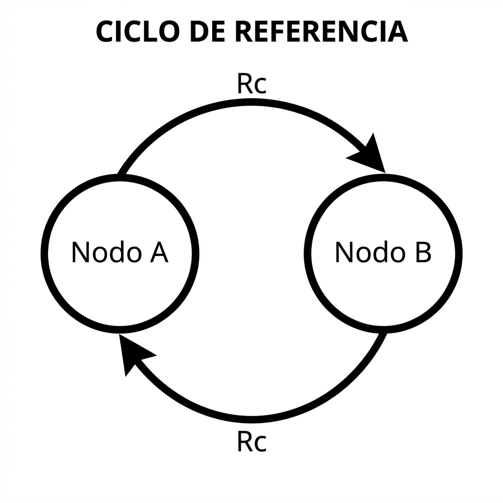

# Smart Pointers

<div align="center">
  
</div>


Vamos a desglosar el sistema de punteros inteligentes (Smart Pointers) de Rust. A diferencia de las referencias normales, estas son estructuras de datos actúan como punteros pero poseen capacidades adicionales de gestión de propiedad.

Estos tipos son herramientas poderosas para manejar la memoria sin un recolector de basura (Garbage Collector). Para empezar a desenredar esto, dividiremos los temas en 3 secciones para finalmente integrar todo.

1.  **Los Fundamentos (Box, Deref, Drop):** Entender cómo `Box<T>` aloja datos en el *heap* 📦 y cómo los traits `Deref` y `Drop` son la "magia" que permite que funcionen como referencias y se limpien solos.
2.  **Propiedad Compartida (Rc y Weak):** Analizar cómo `Rc<T>` (*Reference Counting*) permite que un dato tenga múltiples dueños 🤝 y cómo `Weak<T>` ayuda a evitar fugas de memoria por ciclos.
3.  **Mutabilidad Interior (RefCell):** Explorar el patrón de *Interior Mutability* con `RefCell<T>`, que permite mutar datos incluso cuando el puntero es inmutable, moviendo los chequeos de seguridad al tiempo de ejecución 🛡️.

---

## 1. Los Fundamentos: `Box<T>`, `Deref` y `Drop`

`Box<T>` es el *smart pointer* más fundamental y nos servirá de base para entender los demás.

En Rust, por defecto, los valores con un tamaño conocido y fijo se almacenan en el **stack** (pila). Pero, ¿qué pasa si tenemos un dato muy grande o cuyo tamaño podría cambiar? Ahí entra `Box`.

`Box<T>` te permite almacenar datos en el **heap** (montón) en lugar del *stack*. Lo que se queda en el *stack* es solo el puntero (la dirección de memoria) hacia esos datos en el *heap*.

Mira este ejemplo sencillo:

```rust
fn main() {
    let b = Box::new(5);
    println!("b = {}", b);
}
```

En este caso, tenemos la variable `b` y el valor `5`.

> **Pregunta:** Basándonos en lo que acabamos de mencionar sobre el *stack* y el *heap*, ¿dónde crees que se almacena físicamente el número `5` y dónde se almacena el puntero `b`?
>
> **Respuesta:** El **puntero** (que es pequeño y de tamaño fijo) se queda en el **stack** para un acceso rápido, y actúa como el "dueño" de los datos pesados que residen en el **heap**.

Esto nos lleva directamente a entender por qué los traits `Drop` y `Deref` son vitales aquí:

1.  **`Drop` (La limpieza 🧹):** Como Rust no tiene *Garbage Collector*, necesita saber cuándo liberar esa memoria del *heap*. El trait `Drop` contiene el código que se ejecuta automáticamente cuando el puntero del *stack* sale de su ámbito (*scope*). Si no existiera, ¡esa memoria en el *heap* se quedaría ocupada para siempre (*memory leak*)!
2.  **`Deref` (El acceso 🔓):** Este trait permite que el `Box` se comporte como una referencia normal. Sin él, `b` sería solo una estructura opaca y no podrías "ver" el número `5` que hay dentro fácilmente.

### El poder de `Deref` en acción

Para comprobar cómo funciona `Deref`, imagina este escenario:

```rust
let x = 5;
let b = Box::new(5);

// Esto da error porque 'x' es un i32 y 'b' es un Box<i32>
// if x == b { ... }
```

> **Pregunta:** Para arreglar esa comparación y acceder al valor `5` dentro de la caja, ¿qué operador tendríamos que poner delante de la `b`?
>
> **Respuesta:** El **operador de desreferencia `*`** es la solución.

Cuando escribes `*b`, Rust consulta internamente el trait `Deref`. Este trait le dice al compilador: *"Ey, aunque soy una estructura (un Box), si me ponen un `*` delante, quiero que devuelvas el valor al que estoy apuntando"*.

El código corregido quedaría así:

```rust
fn main() {
    let x = 5;
    let b = Box::new(5);

    if x == *b { // El * accede al valor 5 en el heap
        println!("¡Son iguales!");
    }
}
```

#### Implementando `Deref` manualmente

Para entender qué hace Rust por debajo, podemos crear nuestra propia versión de un Box (aunque esta se guarde en el stack para simplificar):

```rust
use std::ops::Deref;

struct MyBox<T>(T);

impl<T> MyBox<T> {
    fn new(x: T) -> MyBox<T> {
        MyBox(x)
    }
}

impl<T> Deref for MyBox<T> {
    type Target = T;

    fn deref(&self) -> &Self::Target {
        &self.0 // Devolvemos una referencia al valor interno
    }
}

fn main() {
    let x = 5;
    let y = MyBox::new(x);

    assert_eq!(5, x);
    assert_eq!(5, *y); // ¡Gracias a Deref podemos usar el *!
}
```

### La importancia de `Drop`

Ya sabemos que `b` (el puntero) vive en el *stack* y los datos viven en el *heap*. Cuando una función termina, todo lo que está en su *stack* se destruye automáticamente.

> **Pregunta:** Si la variable `b` desaparece del *stack* al terminar la función, ¿qué crees que debería pasar con el espacio que reservamos en el *heap* para el número `5`?
>
> **Respuesta:** Se libera el espacio que reservamos en el *heap* para evitar *memory leaks*.

En Rust, el trait `Drop` se encarga de esto automáticamente. En cuanto la variable `b` sale de su ámbito (por ejemplo, al encontrar la llave de cierre `}` de la función), Rust llama a `drop`, libera el espacio en el *heap* y te ahorra tener que hacerlo manualmente (como se haría con `free` en C o `delete` en C++).

#### Implementando `Drop` manualmente

Podemos añadir un mensaje personalizado para ver exactamente cuándo Rust decide limpiar nuestra estructura:

```rust
struct MyBox<T>(T);

impl<T> Drop for MyBox<T> {
    fn drop(&mut self) {
        println!("¡Limpiando los datos de MyBox! 🧹");
    }
}

fn main() {
    let _c = MyBox(String::from("datos pesados"));
    println!("MyBox creado.");
} // <--- Aquí se ejecuta el código de Drop automáticamente
```

### Recapitulación de Fundamentos:
*   **`Box<T>`:** Puntero en *stack*, datos en *heap*.
*   **`Deref`:** Nos permite usar `*` para acceder a los datos.
*   **`Drop`:** Limpia la memoria automáticamente al salir del ámbito.

---

---

## 2. Propiedad Compartida: `Rc<T>` y `Weak<T>`

Hasta ahora, con `Box`, un dato tiene un solo dueño. Si el dueño desaparece, el dato también. Pero a veces necesitamos que múltiples partes de nuestro programa lean el mismo dato a la vez.

Aquí entra **`Rc` (Reference Counting)**. Imagina una televisión 📺 en una sala de espera: muchas personas la miran, pero nadie es el dueño único y no se puede apagar hasta que la última persona se vaya.

> **Pregunta:** Si `Rc` permite que varias variables sean "dueñas" del mismo dato en el *heap*, ¿cómo crees que sabe Rust cuándo es seguro eliminar (hacer *drop* de) ese dato finalmente?
>
> **Respuesta:** **Cuando no queda ningún dueño.**

Rust implementa esto manteniendo un contador interno:

1.  Cada vez que clonas un `Rc` (`Rc::clone(&a)`), no se copian los datos, sino que incrementamos el contador (*strong count*).
2.  Cada vez que un `Rc` sale de su ámbito (se ejecuta `Drop`), decrementamos el contador.
3.  Solo cuando el contador llega a **0**, Rust limpia los datos del *heap*.

### El Problema de los Ciclos 🔄

Sin embargo, `Rc` tiene un "talón de Aquiles". Imagina que tienes dos estructuras de datos, A y B.
*   A tiene un `Rc` que apunta a B.
*   B tiene un `Rc` que apunta a A.

Esto crea un **ciclo de referencias**. Si las variables externas que apuntaban a A y B desaparecen (salen del *scope*), pero A y B se siguen apuntando mutuamente...

```rust
use std::rc::Rc;
use std::cell::RefCell;

#[derive(Debug)]
struct Nodo {
    valor: i32,
    siguiente: RefCell<Option<Rc<Nodo>>>,
}

fn main() {
    let a = Rc::new(Nodo {
        valor: 5,
        siguiente: RefCell::new(None),
    });

    let b = Rc::new(Nodo {
        valor: 10,
        siguiente: RefCell::new(Some(Rc::clone(&a))),
    });

    // Creamos el ciclo: a apunta a b
    *a.siguiente.borrow_mut() = Some(Rc::clone(&b));

    println!("a strong count = {}", Rc::strong_count(&a));
    println!("b strong count = {}", Rc::strong_count(&b));

    // Al salir de main, los contadores bajarán a 1... ¡Pérdida de memoria!
}
```

<div align="center">
  
</div>

> **Pregunta:** ¿Qué crees que pasará con el contador de referencias de cada uno? ¿Llegará alguna vez a cero para que se limpien?
>
> **Respuesta:** Los contadores quedarán en **1**, por lo que no se limpiarán, resultando en un problema de **fuga de memoria (memory leak)**.

Como el contador de referencias (`strong_count`) nunca llega a 0 porque se apuntan mutuamente, Rust no limpia esa memoria y tienes una fuga.

### La Solución: `Weak<T>` 🔗💔

Para romper estos ciclos, Rust nos ofrece **`Weak<T>`**. Es una versión "débil" de `Rc`.

*   **No es dueño:** Crear un puntero `Weak` no incrementa el `strong_count`.
*   **No protege:** Si todos los `Rc` (dueños fuertes) desaparecen, el dato se borra, aunque todavía existan punteros `Weak` apuntando a él.

Mira este ejemplo completo de una estructura **Padre-Hijo**:

```rust
use std::rc::{Rc, Weak};
use std::cell::RefCell;

#[derive(Debug)]
struct Nodo {
    valor: i32,
    padre: RefCell<Weak<Nodo>>,    // Referencia débil al padre
    hijos: RefCell<Vec<Rc<Nodo>>>, // Referencia fuerte a los hijos
}

fn main() {
    // 1. Creamos la hoja (hijo)
    let hoja = Rc::new(Nodo {
        valor: 3,
        padre: RefCell::new(Weak::new()),
        hijos: RefCell::new(vec![]),
    });

    {
        // 2. Creamos la rama (padre) en un ámbito interno
        let rama = Rc::new(Nodo {
            valor: 5,
            padre: RefCell::new(Weak::new()),
            hijos: RefCell::new(vec![Rc::clone(&hoja)]),
        });

        // Hacemos que la hoja apunte a la rama (padre) usando Weak
        *hoja.padre.borrow_mut() = Rc::downgrade(&rama);

        println!("DENTRO: El padre (rama) tiene {} dueños fuertes.", Rc::strong_count(&rama));
    }

    // Al salir del bloque, 'rama' se destruye porque su strong_count llegó a 0.
    
    println!("--- FUERA DEL ÁMBITO ---");

    // 3. Intentamos acceder al padre. 
    // Clonamos el Weak para liberar el borrow() inmediatamente y evitar errores de tiempo de vida.
    let padre_weak = hoja.padre.borrow().clone(); 
    
    if let Some(padre_rc) = padre_weak.upgrade() {
        println!("El padre sigue vivo: {}", padre_rc.valor);
    } else {
        println!("El padre ha sido liberado de la memoria.");
    }
}

```

### ¿Por qué `upgrade()` devuelve un `Option`?

Dado que un puntero `Weak` no garantiza que el valor siga existiendo, no podemos acceder al dato directamente.

> **Pregunta:** ¿Qué mecanismo de seguridad crees que usa Rust para permitirnos intentar acceder a ese valor, manejando la posibilidad de que ya no esté ahí?
>
> **Respuesta:** El método **`.upgrade()`**, el cual devuelve un **`Option<Rc<T>>`**:
> *   **`Some(Rc<T>)`:** ¡El valor sigue vivo! Obtienes un nuevo `Rc` temporal.
> *   **`None`:** El valor fue eliminado.

---

## 3. Mutabilidad Interior: `RefCell<T>`

Ahora llegamos a la pieza final del rompecabezas: **`RefCell<T>`**.

Hasta ahora, `Rc<T>` nos permite tener múltiples dueños, pero tiene una restricción importante: el contenido es inmutable. No puedes modificar el dato compartido, porque Rust prohíbe tener múltiples referencias mutables al mismo tiempo para evitar carreras de datos (*data races*).

Pero, ¿qué pasa si necesitas modificar el dato, pero también necesitas compartirlo con `Rc`?

Aquí entra `RefCell`. Te permite modificar el dato (mutarlo) incluso cuando tienes una referencia inmutable al `RefCell`. A esto se le llama **Interior Mutability**.

### Tiempo de Compilación vs. Tiempo de Ejecución

Normalmente, el compilador de Rust (el *borrow checker*) es muy estricto y revisa las reglas de préstamo durante la compilación. Con `RefCell`, esas reglas se siguen aplicando, pero el momento de la revisión cambia.

> **Pregunta:** ¿Cuándo crees que `RefCell` verifica si estás rompiendo las reglas (como intentar tener dos referencias mutables a la vez)?
>
> **Respuesta:** **Durante la ejecución (Runtime).**

Mientras que la mayoría de los errores de memoria en Rust te detienen antes de compilar, `RefCell` espera hasta que el programa se está ejecutando para revisar las reglas. Esto nos da flexibilidad, pero tiene un precio: si rompes las reglas de préstamo en tiempo de ejecución, el programa entrará en pánico (**panic!**) y se cerrará. 💥

### Recordando las Reglas de Préstamo (*Borrowing Rules*)

Para entender los errores de `RefCell`, debemos tener siempre presente la "regla de oro" de Rust:

1.  En cualquier momento dado, puedes tener **una** referencia mutable **O** **cualquier número** de referencias inmutables.
2.  Las referencias deben ser siempre válidas.

### Interactuando con `RefCell`

Para interactuar con el valor dentro de un `RefCell`, usamos dos métodos principales:
*   **`borrow()`**: Devuelve un `Ref<T>` (actúa como una referencia inmutable `&T`).
*   **`borrow_mut()`**: Devuelve un `RefMut<T>` (actúa como una referencia mutable `&mut T`).

Imagina este escenario de error:

```rust
use std::cell::RefCell;

let celda = RefCell::new(10);

// 1. Pedimos permiso para escribir (mutable)
let escritura = celda.borrow_mut(); 

// 2. Intentamos pedir permiso para leer (inmutable) mientras 'escritura' sigue activa
let lectura = celda.borrow();
```

> **Pregunta:** Dado que `RefCell` chequea esto en tiempo de ejecución, ¿qué crees que ocurrirá exactamente en la línea 2 cuando intentemos ejecutar el código?
>
> **Respuesta:** El programa entrará en **panic**, ya que violamos la regla: tenemos una referencia de escritura activa e intentamos crear una de lectura. Verás un mensaje como: `thread 'main' panicked at 'already borrowed: BorrowMutError'`.

---

## La Combinación Poderosa: `Rc<RefCell<T>>` 🤝🔓

Ahora que entendemos las piezas por separado, podemos combinarlas para resolver un problema muy común en Rust: tener datos que tienen múltiples dueños **Y** que pueden ser modificados.

*   **`Rc<T>`**: Permite múltiples dueños, pero es inmutable.
*   **`RefCell<T>`**: Permite mutabilidad, pero tiene un solo dueño.

Si envolvemos uno dentro del otro como **`Rc<RefCell<T>>`**, obtenemos lo mejor de ambos mundos.

```rust
use std::rc::Rc;
use std::cell::RefCell;

let compartido = Rc::new(RefCell::new(5));

// Clonamos el Rc (nuevo dueño)
let otro_dueno = Rc::clone(&compartido);
```

> **Pregunta:** Si quisieras sumar 10 al valor usando la variable `otro_dueno`, ¿cómo escribirías esa línea de código?
>
> **Respuesta:** Puedes hacerlo así: `*otro_dueno.borrow_mut() += 10;` (o también usando `compartido`).

Lo que está sucediendo ahí paso a paso es:
1.  **Auto-deref**: Al llamar a `.borrow_mut()`, Rust sigue automáticamente el puntero `Rc` hasta encontrar el `RefCell` dentro.
2.  **El Guardián**: `borrow_mut()` devuelve un `RefMut` (un guardián inteligente).
3.  **Desreferencia manual**: El `*` al principio accede al valor real dentro de ese guardián para modificarlo.

### Prueba de fuego final 🔥

Analiza este escenario:

```rust
// 1. Obtenemos un permiso de escritura y lo guardamos en una variable
let mut permiso_escritura = compartido.borrow_mut();
*permiso_escritura += 10;

// 2. Intentamos leer el dato usando el OTRO puntero (otro_dueno)
//    mientras la variable 'permiso_escritura' sigue viva.
println!("Valor: {}", otro_dueno.borrow());
```

> **Pregunta:** Sabiendo que ambos `Rc` apuntan a la misma celda, ¿qué crees que ocurrirá al llegar a la línea del `println!`?
>
> **Respuesta:** El programa compilará sin problemas, pero al momento de ejecución (**runtime**) entrará en **panic**, porque `RefCell` detecta que hay un préstamo mutable activo (`permiso_escritura`) mientras intentas realizar un préstamo inmutable (`borrow`).

Esto tiene un pequeñísimo costo de rendimiento, pero nos da la flexibilidad necesaria para patrones complejos como la **Mutabilidad Interior**.

---

## El Desafío Final: El Árbol Genealógico 🌳

Para graduarnos en *Smart Pointers*, vamos a combinar todo (`Rc`, `RefCell` y `Weak`) en una sola estructura de datos. Este es el uso más común en el mundo real: un árbol donde los nodos se relacionan entre sí.

Queremos definir un `struct Node` con estos requisitos:
1.  **Valor:** Un simple `i32`.
2.  **Hijos (`children`):** Un nodo "posee" a sus hijos. Queremos poder compartir los hijos y también modificarlos si es necesario.
3.  **Padre (`parent`):** Un hijo debe poder referenciar a su padre, pero sin ser dueño de él (para evitar el ciclo de memoria).

> **Pregunta:** Basándonos en lo que hemos visto, ¿cómo definirías los tipos de datos para los campos `children` y `parent` en este struct?
>
> ```rust
> struct Node {
>     value: i32,
>     children: Vec<...>, // ¿Qué ponemos aquí?
>     parent: ...         // ¿Y aquí?
> }
> ```
>
> **Respuesta:** Así quedaría el diseño correcto:
>
> ```rust
> struct Node {
>     value: i32,
>     children: RefCell<Vec<Rc<Node>>>,
>     parent: RefCell<Weak<Node>>,
> }
> ```

### Analicemos el diseño implementado:

*   **`children: RefCell<Vec<Rc<Node>>>`**:
    *   **`Rc`**: Los hijos son propiedad compartida (el árbol y cualquier otra variable externa pueden poseerlos).
    *   **`RefCell`**: Te permite mutar la estructura del árbol (añadir o quitar hijos) en tiempo de ejecución, incluso si tu puntero al nodo es inmutable.
*   **`parent: RefCell<Weak<Node>>`**:
    *   **`Weak`**: ¡La clave maestra! 🔑 Al usar una referencia débil hacia arriba, evitas el temido ciclo de referencias (`Rc` apunta hacia abajo, `Weak` apunta hacia arriba). Cuando el padre se destruye, los hijos se limpian correctamente.
    *   **`RefCell`**: Necesario porque, al crear un nodo, a menudo no sabes quién será su padre todavía (o podría cambiar), así que necesitas mutabilidad interior para asignarlo después.

---

### Perfeccionando la Mutabilidad

Ahora, para terminar de pulir tu maestría en Rust, te planteo un escenario práctico:

> **Pregunta:** Digamos que tienes una variable `let nodo: Rc<Node> = ...;`. Gracias a tus `RefCell`, puedes añadir hijos o cambiar el padre. Pero, ¿qué pasaría si intentas ejecutar la siguiente línea para cambiar el número almacenado?
>
> `nodo.value = 42;`
>
> ¿Funcionaría? ¿Por qué?
>
> **Respuesta:** **No funcionaría.** El `Rc` hace que todo el struct sea inmutable de cara al exterior. Cuando accedes a través de un `Rc`, solo obtienes una referencia compartida (`&Node`), lo que impide modificar cualquier campo directamente.
> *   `value: i32`: Queda "congelado". No se puede cambiar.
> *   `children` y `parent`: Aunque el struct parece congelado, como son `RefCell`, tienen **mutabilidad interior**. Tienen la capacidad de "descongelarse" a sí mismos en tiempo de ejecución para permitir cambios.

> **Pregunta Final:** Si tu requisito cambiara y sí necesitas actualizar el valor numérico del nodo después de haberlo creado, ¿cómo tendrías que redefinir el campo `value`?
>
> **Respuesta:** El struct debería usar `RefCell` para el valor también:
>
> ```rust
> struct Node {
>     value: RefCell<i32>,
>     children: RefCell<Vec<Rc<Node>>>,
>     parent: RefCell<Weak<Node>>,
> }
> ```
> Para modificarlo, usaríamos: `*nodo.value.borrow_mut() = 42;`

---

Hemos construido una de las estructuras más complejas y potentes en Rust. Con esto, has cubierto los cuatro pilares: **`Box`**, **`Rc`**, **`RefCell`** y **`Weak`**, junto con la magia de **`Deref`** y **`Drop`**.

---

## Resumen: Elección de Punteros Inteligentes

Aquí tienes una recapitulación de cuándo elegir entre `Box<T>`, `Rc<T>` y `RefCell<T>`:

| Tipo | Propiedad | Reglas de Préstamo | Mutabilidad |
| :--- | :--- | :--- | :--- |
| **`Box<T>`** | Un solo dueño | Tiempo de compilación | Inmutable o Mutable |
| **`Rc<T>`** | Múltiples dueños | Tiempo de compilación | Solo Inmutable |
| **`RefCell<T>`** | Un solo dueño | Tiempo de ejecución | **Mutabilidad Interior** |

---

### Guía Rápida de Selección

*   **Usa `Box<T>` cuando:**
    *   Tengas un tipo cuyo tamaño no se conoce en tiempo de compilación (como estructuras recursivas).
    *   Quieras transferir la propiedad de un dato grande evitando copias costosas en el *stack*.
*   **Usa `Rc<T>` (*Reference Counted*) cuando:**
    *   Necesites que un mismo dato en el *heap* tenga **múltiples propietarios** (ej. un grafo o una lista compartida).
    *   *Nota:* Solo funciona en escenarios de un solo hilo.
*   **Usa `RefCell<T>` cuando:**
    *   Necesites modificar un dato incluso cuando solo tienes referencias inmutables a él.
    *   Estés seguro de que las reglas de préstamo de Rust se cumplen, pero prefieras que se validen en **tiempo de ejecución**.

> **⚠️ Advertencia Importante:** Tanto `Rc<T>` como `RefCell<T>` no son seguros para hilos (*not thread-safe*). Para aplicaciones multihilo, deberás considerar el uso de `Arc<T>` y `Mutex<T>` o `RwLock<T>`.
